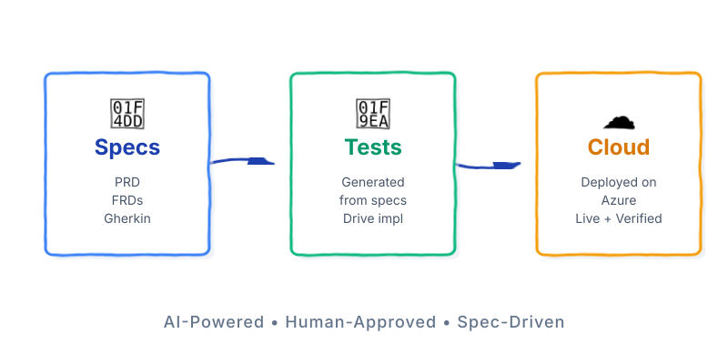
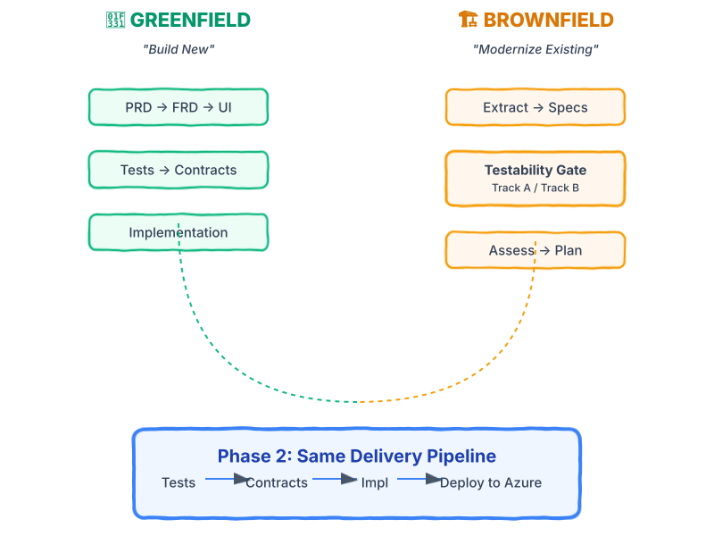

# spec2cloud

**Transform product specifications into production-ready applications on Azure — AI-powered, human-approved, spec-driven.**

<p align="center">
  
</p>

## What is spec2cloud?

spec2cloud is a spec-driven development framework where **specifications are the single source of truth**. Tests are generated from specs, implementation makes those tests pass, and the result is deployed to Azure — all orchestrated by an AI agent with **43 specialized skills**. Every step is resumable, auditable, and requires human approval before anything ships.

## Why spec2cloud?

- **Specifications are the source of truth** — not code, not comments, not wikis
- **Tests before code** — every feature has tests before implementation begins
- **Human approval at every gate** — nothing ships without your sign-off
- **Resumable from any point** — state persisted in git, pick up where you left off
- **Works for new and existing apps** — greenfield builds new, brownfield modernizes existing

## Two Paths, One Pipeline

<p align="center">
  
</p>

**Greenfield** — Start with a product idea → PRD → FRD → UI → Tests → Contracts → Implementation → Deployed on Azure.

**Brownfield** — Start with existing code → Extract specs → Testability gate → Green baseline or behavioral docs → Assess → Plan → Same delivery pipeline.

Both converge on the same **Phase 2 delivery**: Tests → Contracts → Implementation → Deploy.

## Quick Start

```bash
# Option 1: npx (recommended)
npx spec2cloud init

# Option 2: Quick install script
curl -fsSL https://raw.githubusercontent.com/EmeaAppGbb/spec2cloud/vNext/scripts/quick-install.sh | bash

# Option 3: Start from a shell template (new projects)
npx spec2cloud init --shell nextjs-typescript
```

See **[INTEGRATION.md](INTEGRATION.md)** for detailed installation options and configuration.

## Learn More

| Start Here | Then Explore | Go Deeper |
|-----------|-------------|-----------|
| [Quick Start](docs/quickstart.md) | [Greenfield Guide](docs/greenfield.md) | [Skills Catalog](docs/skills.md) |
| [Core Concepts](docs/concepts.md) | [Brownfield Guide](docs/brownfield.md) | [State & Gates](docs/state-and-gates.md) |
| | [Examples](docs/examples/) | [Architecture](docs/architecture.md) |

## Skills

43 specialized skills power the framework — from spec refinement and test generation to Azure deployment and security assessment. [See the full catalog →](docs/skills.md)

## Contributing

Contributions welcome! You can:
- Create new skills following the [agentskills.io spec](https://agentskills.io/specification)
- Build new shell templates for different tech stacks
- Publish skills to [skills.sh](https://skills.sh/)

## License

See [LICENSE.md](LICENSE.md) for details.

---

**From idea to production — spec-driven, AI-powered, human-approved.**
