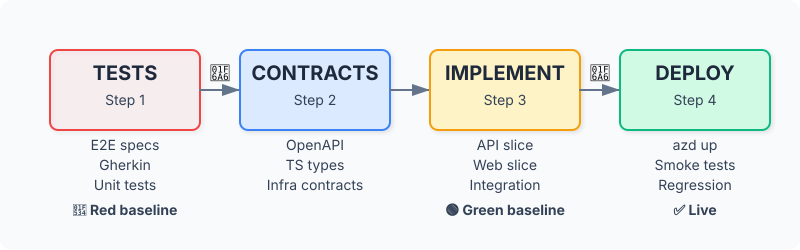

# Examples & Walkthroughs

Concrete scenarios showing spec2cloud in action.

## Example 1: Greenfield — Task Management App

A team wants to build a task management application with Next.js, deployed on Azure.

### The Journey

**Starting point:** A one-page PRD describing a task management app with boards, lists, cards, due dates, and team collaboration.

**Phase 0 — Shell Setup**

The team clones `spec2cloud-shell-nextjs-typescript` and runs the installer. They get a project scaffold with Next.js, Express, Playwright, Cucumber, Vitest, and Azure Bicep templates pre-configured.

**Phase 1a — Spec Refinement**

The orchestrator reviews the PRD through product and technical lenses. After 3 passes, it identifies missing edge cases (what happens when a board has 1000+ cards?), clarifies permission model (who can edit vs. view?), and splits the PRD into 4 FRDs: Board Management, Card Operations, Team Collaboration, Notifications.

**Human Gate:** Team reviews refined PRD and FRDs. Approves after minor wording adjustments.

**Phase 1b — UI/UX Design**

Interactive HTML prototypes are generated: board view, card detail modal, team settings, notification panel. The prototypes are served on localhost for the team to click through.

**Human Gate:** Team approves designs with feedback on mobile layout.

**Phase 1c — Increment Planning**

Three increments planned:

1. Walking skeleton — Board CRUD + single card creation (proves the architecture)
2. Full card operations — Drag-and-drop, due dates, labels, attachments
3. Collaboration — Team members, permissions, notifications

**Phase 1d — Tech Stack Resolution**

Technologies researched and documented as ADRs: Next.js 14 (App Router), Express with Prisma, PostgreSQL on Azure, Azure Container Apps for hosting.

**Phase 2, Increment 1 — Walking Skeleton**

*Step 1: Tests*

- 8 Playwright e2e specs for board/card flows
- 12 Gherkin scenarios for CRUD operations
- 24 Vitest unit test stubs
- All fail (red baseline confirmed)

*Step 2: Contracts*

- OpenAPI spec: 6 endpoints (boards CRUD, cards CRUD)
- TypeScript types: Board, Card, User DTOs
- Bicep: Container App + PostgreSQL Flexible Server

*Step 3: Implementation*

- API Slice: Express routes + Prisma models (parallel)
- Web Slice: Next.js pages + components (parallel)
- Integration: Wire together, all 44 tests pass (green!)

*Step 4: Deploy*

- `azd up` provisions Azure resources
- App deployed, smoke tests pass
- Full e2e regression green on production URL

**Result:** Working task management app with board and card creation, live on Azure, after Increment 1. Two more increments follow the same cycle.

---

## Example 2: Brownfield — Modernizing an Express API

A team has a legacy Express.js API (Node 14, no TypeScript, minimal tests) and wants to modernize it.

### The Journey

**Starting point:** An existing Express API with 45 routes, MongoDB, no TypeScript, and 12% test coverage.

**Phase B1 — Extract**

- **Codebase Scanner** finds: Node.js 14, Express 4.17, MongoDB via Mongoose, 3 middleware layers, no TypeScript
- **Dependency Inventory**: 67 dependencies, 12 with known vulnerabilities, 8 deprecated
- **Architecture Mapper**: Monolithic, 3 layers (routes → services → models), no clear domain boundaries
- **API Extractor**: 45 REST endpoints documented, 7 undocumented
- **Test Discovery**: 12% coverage, only integration tests, no unit tests

**Phase B2 — Spec-Enable**

- PRD generated from codebase analysis
- 6 FRDs generated, each with "Current Implementation" sections documenting how features work today

**Human Gate — Choose Paths**

Team selects: Modernize (update deps, add TypeScript) + Security (fix vulnerabilities)

**Phase A — Assess**

- **Modernization Assessment (Level 2)**: Identifies Node 14 EOL, 8 deprecated packages, callback-heavy patterns, missing error handling
- **Security Assessment**: 12 vulnerable deps, 3 SQL injection risks in string concatenation, missing rate limiting

**Phase P — Plan**

4 increments planned:

1. Security fixes — Patch vulnerabilities, add rate limiting
2. TypeScript migration — Convert to TypeScript incrementally
3. Dependency updates — Update to Node 20, Express 5, modern Mongoose
4. Test coverage — Achieve 80% coverage with unit + integration tests

**Phase 2 — Delivery**

Each increment follows the same Tests → Contracts → Implementation → Deploy cycle. The legacy API gains TypeScript, modern dependencies, security hardening, and comprehensive test coverage—without a full rewrite.

---

## Key Takeaways

Both examples demonstrate the same principles: specifications drive tests, tests drive implementation, human gates ensure quality, and every action is resumable from git-persisted state. Whether you're building from scratch or modernizing legacy code, the delivery pipeline is identical.
