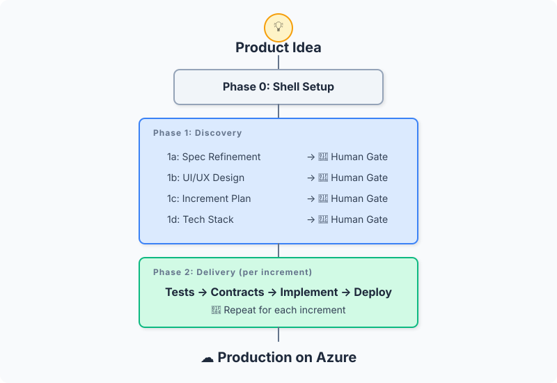

# spec2cloud: Visual Overview

## What is spec2cloud?

spec2cloud transforms product specifications into production-ready applications deployed on Azure. Instead of manually translating requirements into code, spec2cloud uses an AI-powered orchestrator (the Ralph Loop) that coordinates 43 specialized skills to systematically move from specification to working software.

The framework follows a test-first philosophy: tests are generated from specifications before any code is written. Implementation means making those tests pass. Everything is resumable—state is persisted in git after every action, so you can stop and restart at any point. Human gates at critical checkpoints ensure quality, security, and alignment with intent before proceeding to production.

Two paths exist: Greenfield for building new applications from scratch, and Brownfield for modernizing, extending, or rewriting existing codebases. Both converge on the same delivery pipeline, ensuring consistent quality regardless of starting point.

## The Orchestrator

The Ralph Loop reads the current state, determines the next logical task in the development cycle, executes that task through the appropriate skill(s), validates the results, and persists state to git. This cycle repeats, progressively moving your specification toward a deployed, tested, and auditable application.

## Two Paths, One Pipeline

### Greenfield: Spec → Cloud

Start with a specification. The Ralph Loop orchestrates skills to generate tests, architecture, implementation, and deployment—all from your specification alone. Perfect for new products and fresh codebases.

### Brownfield: Code → Spec → Cloud

Start with existing code. Reverse-engineer your codebase into a specification, then proceed through the same pipeline as greenfield. Modernize legacy systems, extend platforms, or rewrite components with confidence.

## Key Numbers

| Aspect | Value |
|--------|-------|
| Specialized Skills | 43 |
| Orchestration Steps | 11 |
| Human Gate Checkpoints | 4 |
| Supported Workflows | 2 |

---

Ready to start? Head to [Quick Start](quickstart.md) or explore the [Core Concepts](architecture.md).
